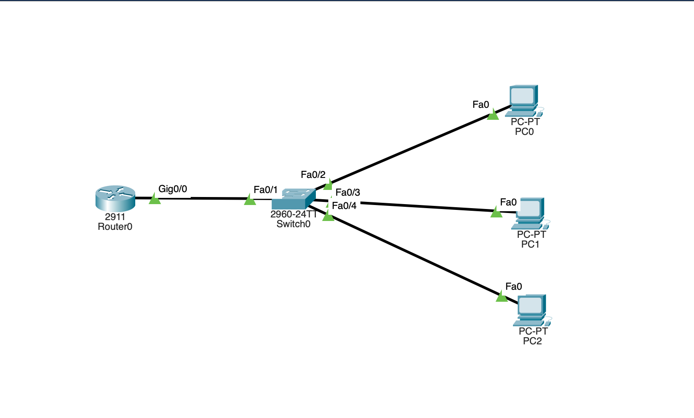
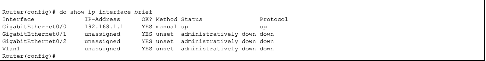
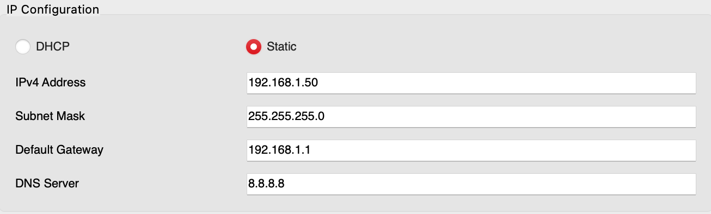
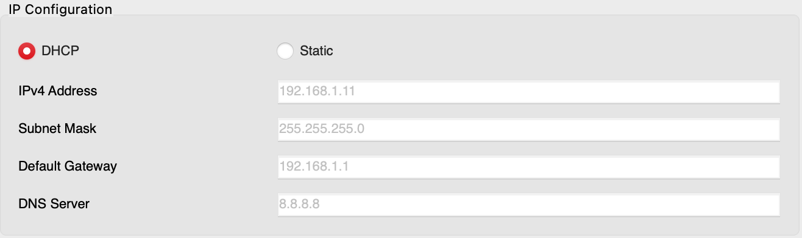
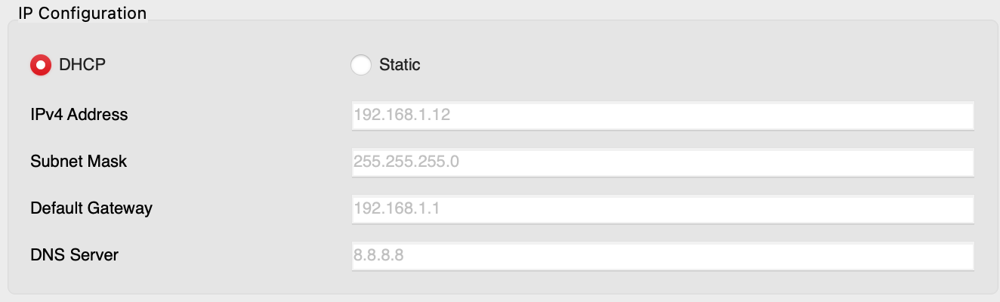
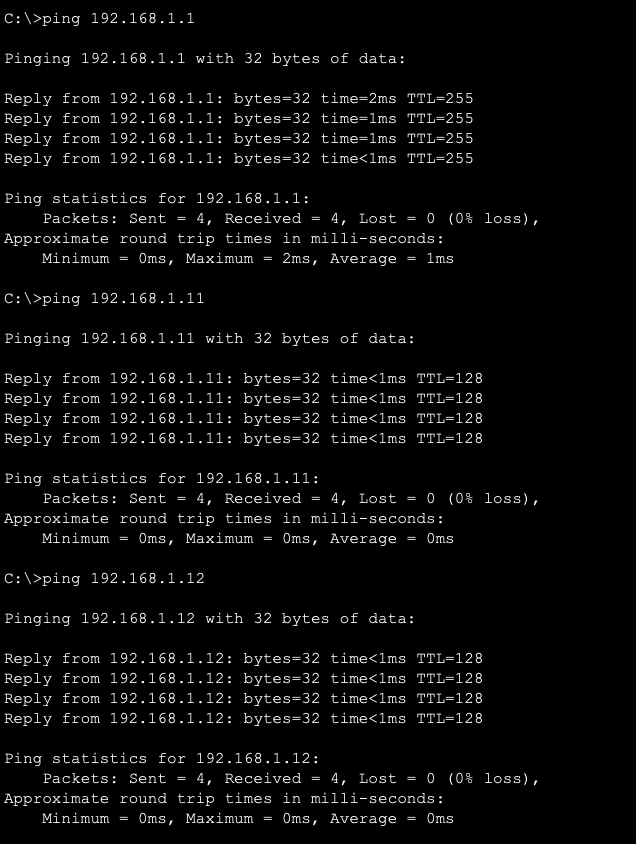
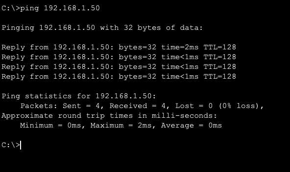

# Lab 1 — Basic Addressing (Static IP and DHCP)

## Goal

Build a small single-subnet network and address the hosts two different ways: one PC with a static IP, and the rest pulling addresses automatically from a DHCP pool on the router. Then verify everything can reach everything with ping.

## Topology

One router, one switch, and three PCs on the `192.168.1.0/24` network. The router's interface is the default gateway at `192.168.1.1`. PC0 is static, PC1 and PC2 use DHCP.



## Router interface configuration

```cisco
interface GigabitEthernet0/0
 ip address 192.168.1.1 255.255.255.0   ! give the router the gateway address
 no shutdown                            ! bring the interface up (it is off by default)
 exit
do show ip interface brief              ! confirm the interface shows up / up
```



## DHCP configuration

```cisco
! Reserve the low addresses so DHCP never hands them out (gateway, static hosts, etc.)
ip dhcp excluded-address 192.168.1.1 192.168.1.10

! Create the pool that hands out the rest of the range
ip dhcp pool LAN_POOL
 network 192.168.1.0 255.255.255.0      ! the subnet DHCP serves
 default-router 192.168.1.1             ! gateway given to clients
 dns-server 8.8.8.8                     ! DNS server given to clients
 exit
write memory                            ! save the config so it survives a reload
```

This leaves `192.168.1.1` through `192.168.1.10` reserved and hands out `192.168.1.11` and up to DHCP clients.

## PC addressing

PC0 was set static to `192.168.1.50`. PC1 and PC2 were set to DHCP and received `192.168.1.11` and `192.168.1.12` from the pool.







## Connectivity testing

Pings from PC0 to the gateway and to both DHCP clients all succeeded, and a reverse ping from PC1 back to PC0 confirmed two-way communication.





## Outcome

Static and DHCP addressing both worked, the DHCP pool assigned addresses correctly, and every ping returned with zero packet loss.
