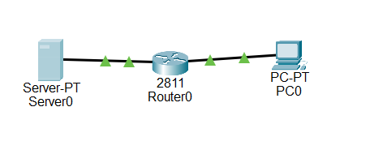
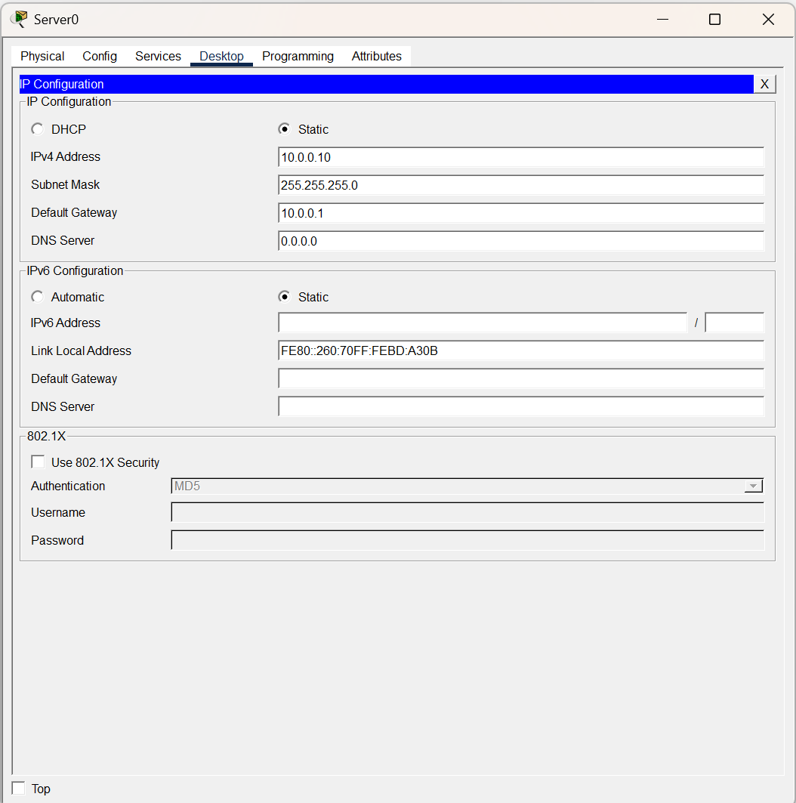
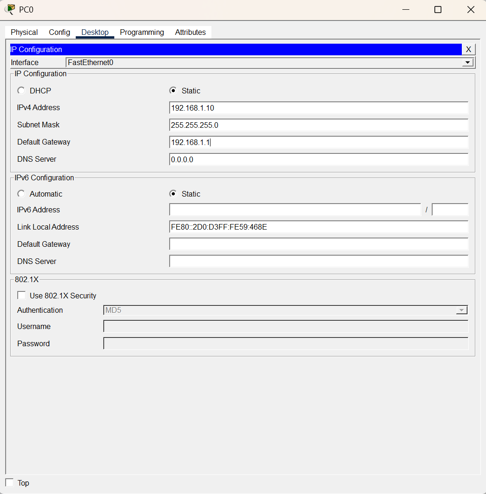
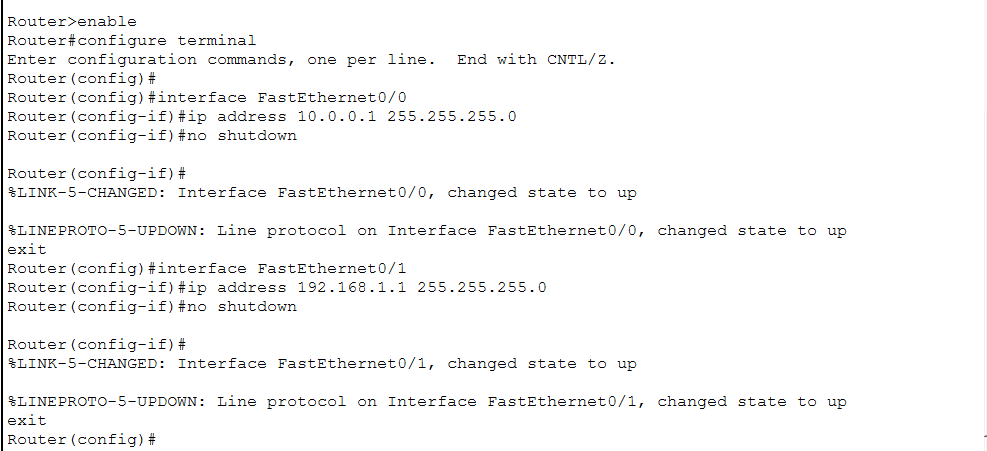
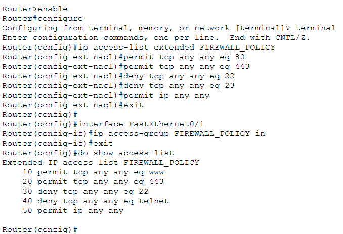
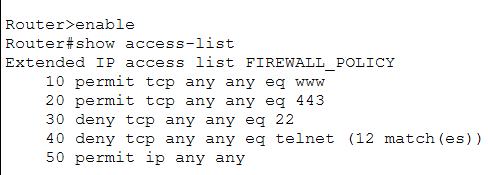
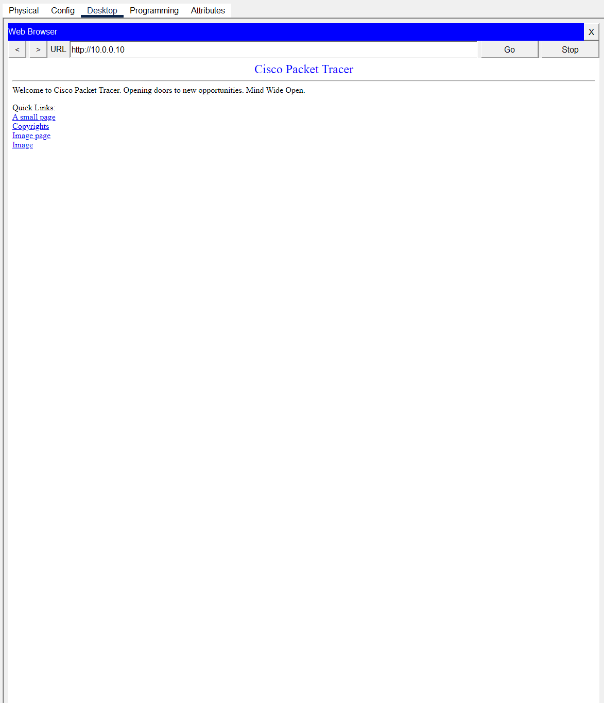
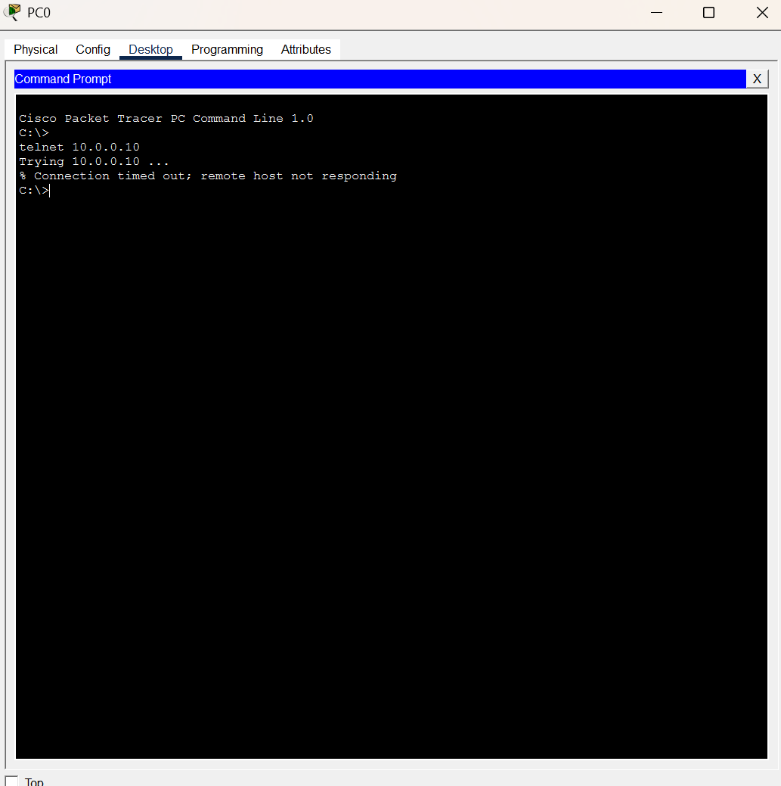
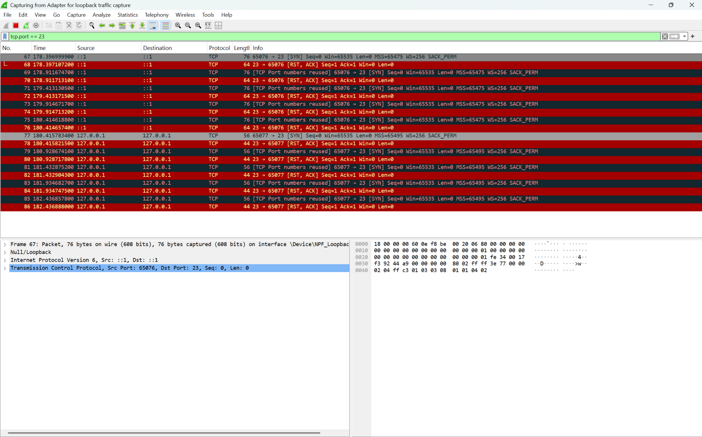
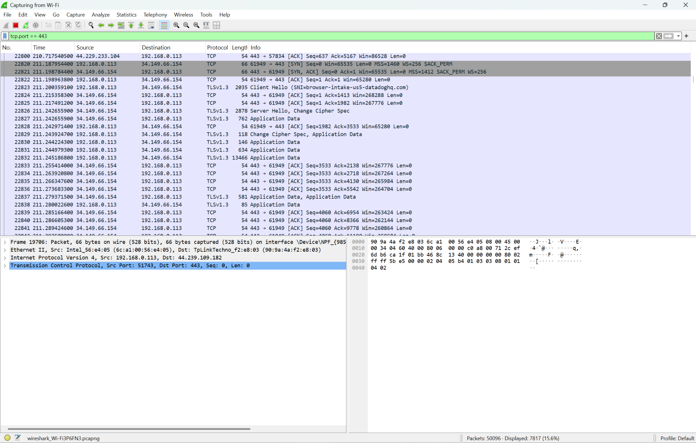

# Lab 3 — ACL Firewall (Access Control)

## Goal

Build a basic firewall on a router using an extended named Access Control List. The policy permits web traffic (HTTP and HTTPS) and blocks remote-login traffic (SSH and Telnet), then proves the policy works with live traffic tests and Wireshark captures.

## Topology

One router with a PC on one side and a server on the other, no switch. The router routes and filters between the two networks.

| Device | Interface | IP Address | Subnet Mask |
|--------|-----------|------------|-------------|
| Router | Fa0/0 | 10.0.0.1 | 255.255.255.0 |
| Router | Fa0/1 | 192.168.1.1 | 255.255.255.0 |
| Server | NIC | 10.0.0.10 | 255.255.255.0 |
| PC | NIC | 192.168.1.10 | 255.255.255.0 |







## Router interfaces

```cisco
interface FastEthernet0/0
 ip address 10.0.0.1 255.255.255.0      ! server-side network
 no shutdown
 exit
interface FastEthernet0/1
 ip address 192.168.1.1 255.255.255.0   ! PC-side network
 no shutdown
 exit
do show ip interface brief              ! confirm both interfaces are up / up
```



## The ACL

An extended named ACL filters by protocol and port. Rules are read top to bottom, and the first match wins.

```cisco
ip access-list extended FIREWALL_POLICY
 permit tcp any any eq 80      ! allow HTTP (web)
 permit tcp any any eq 443     ! allow HTTPS (secure web)
 deny tcp any any eq 22        ! block SSH
 deny tcp any any eq 23        ! block Telnet
 permit ip any any             ! allow everything else (catch-all)
 exit

! Apply it inbound on the PC-facing interface so PC traffic is filtered
! as it ENTERS the router, before it reaches the server.
interface FastEthernet0/1
 ip access-group FIREWALL_POLICY in
 exit
```

| Rule | Description | Port | Action |
|------|-------------|------|--------|
| 10 | permit tcp any any eq www | 80 | Permit |
| 20 | permit tcp any any eq 443 | 443 | Permit |
| 30 | deny tcp any any eq 22 | 22 | Deny |
| 40 | deny tcp any any eq telnet | 23 | Deny |
| 50 | permit ip any any | all | Permit |





## Traffic testing

HTTP to the server loaded successfully, confirming the permit rule. A Telnet attempt timed out, and the `show access-list` hit counter on the deny rule climbed with each attempt, confirming the block.





## Wireshark verification

The blocked Telnet capture showed SYN packets immediately answered by RST/ACK resets, meaning the connection was refused. The allowed HTTPS capture showed a full TLS handshake and data exchange with no resets.





## Key lesson

Placement and direction matter as much as the rules. The ACL was first applied to the server-side interface inbound, which blocked the PC from reaching the server at all, because that direction filters traffic coming from the server, not from the PC. Moving it to the PC-side interface inbound fixed it, so the PC's outbound requests were filtered before crossing the router. An ACL is only as good as the interface and direction you attach it to.

## Outcome

The firewall permitted HTTP and HTTPS, blocked SSH and Telnet, the hit counters confirmed each rule was matched, and the Wireshark captures backed it up at the packet level.
